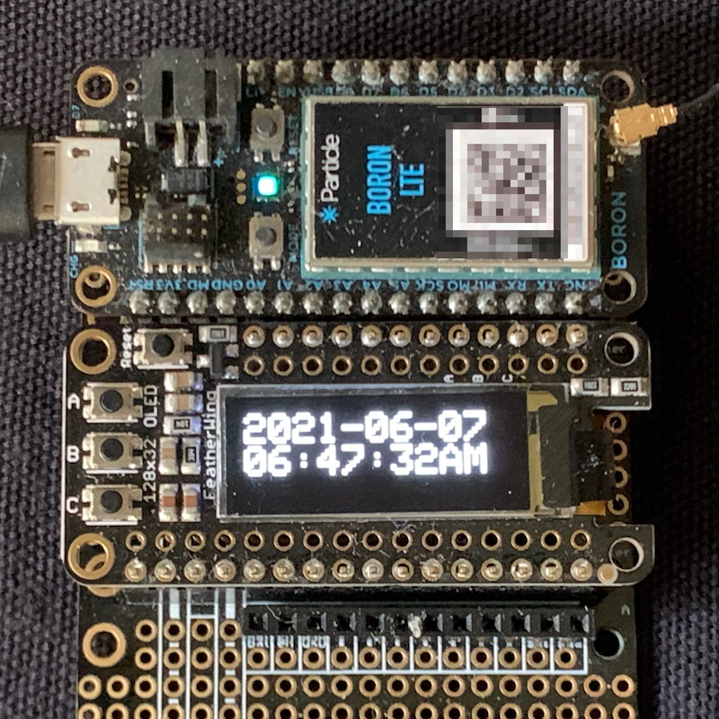

# LocalTimeRK

*Timezone and DST handling for Particle devices*

This library is designed for specific local time and daylight saving time scenarios on Particle devices. It is not intended to solve all problems in all situations, however it will work well in certain scenarios:

- [Full API docs](https://rickkas7.github.io/LocalTimeRK/)
- Github repository: [https://github.com/rickkas7/LocalTimeRK/](https://github.com/rickkas7/LocalTimeRK/)
- License: MIT

**What it's good for:**

- Managing local time, and daylight saving time, if needed, on devices in a known location
- Mostly intended for devices in your own home
- Managing scheduling of tasks at a specific local time
- Displaying local time

**What it's not intended for:**

- Mobile devices that may change locations
- Customer devices that could be in any timezone

## Features

- Timezone configuration using a POSIX timezone rule string
- Does not require network access to determine timezone and daylight saving transitions
- Good for displaying local time, such as on clock-like devices
- Good for scheduling operations at a specific local time. For example, every day at 8:00 AM regardless of timezone and DST
- Support for locations with DST and without DST (timezone only)
- Should work in the southern hemisphere were DST is opposite on the calendar
- Should work in any country as long as a compatible POSIX timezone configuration string can be generated

## What is a POSIX timezone configuration?

For the United States east coast, the configuration string is:

```
EST5EDT,M3.2.0/2:00:00,M11.1.0/2:00:00"
```

What this means is:

- "EST" is the standard time timezone name
- 5 is the offset from UTC in hours. Actually -5, as the sign is backwards from the way it's normally expressed. And it could be hours and minutes.
- "EDT" is the daylight saving time timezone name
- "M3.2.0" is when DST starts. Month 3 (March), 2nd week, 0 = Sunday
- "2:00:00" transition to DST at 2:00 AM local time
- "M11.1.0" transition back to standard time November, 1st week, on Sunday
- "2:00:00" transition back to standard time at 2:00 AM local time

There are a bunch of supported formats, including for locations that don't have DST (such as Arizona, "MST7") and southern hemisphere where daylight saving is on the opposite part of the year, such as Eastern Australian time used in Sydney, Australia "AEST-10AEDT,M10.1.0/02:00:00,M4.1.0/03:00:00".

## Using for scheduling

This library does not modify the `Time` class timezone! This has the potential to disrupt all sorts of things that depend on `Time`, and should be avoided. A new class and methods provide access to local time when needed.

Additionally, it's designed to handle scheduling. For example, say you want to perform an operation at 3:00 AM every day, local time. The class can find the UTC time corresponding to this, taking into account timezones and DST changes. Using `Time.now()` comparisons (at UTC) is fast and efficient. It's also good when you want to store the desired time in EEPROM, retained memory, or the file system.

The library also handles weird transition scenarios that occur on spring forward (in the north hemisphere) where the hour from 2:00 AM local time to 2:59:59 doesn't exist, and in the fall back where the hour from 1:00:00 to 1:59:59 local time occurs twice.

It also handles other common scheduling scenarios:

- Tomorrow (same time)
- Tomorrow (at a specific local time)
- On a specific day of week at a specific time ("every Saturday at 3:00 AM")
- On a day of week with an ordinal ("on the 2nd Saturday of the month")
- On a specific day of month at a specific time
- Also the last day of the month, the second to last day of the month, ...
- On the next weekday (Monday - Friday)
- On the next weekend day (Saturday - Sunday)

## Clock Example

There is an example of using the library to use an Adafruit FeatherWing OLED Display 128x32 as a clock.

The display is available at [Adafruit](https://www.adafruit.com/product/2900). You can find more technical information [at Adafruit](https://learn.adafruit.com/adafruit-oled-featherwing/overview). The library is available in the Web IDE as [oled-wing-adafruit](https://build.particle.io/libs/oled-wing-adafruit/0.0.4/tab/oled-wing-adafruit.cpp). You can find additional documentation [here](https://github.com/rickkas7/oled-wing-adafruit).

The code example is in the more-examples directory in the Clock directory and is quite simple:

```cpp
#include "Particle.h"

#include "LocalTimeRK.h"
#include "oled-wing-adafruit.h"

SerialLogHandler logHandler;

SYSTEM_THREAD(ENABLED);

OledWingAdafruit display;

void setup() {
    // Set timezone to the Eastern United States
    LocalTime::instance().withConfig(LocalTimePosixTimezone("EST5EDT,M3.2.0/2:00:00,M11.1.0/2:00:00"));

	display.setup();

	display.clearDisplay();
	display.display();
}

void loop() {
    static unsigned long lastUpdate = 0;
    if (millis() - lastUpdate >= 1000 && Time.isValid()) {
        lastUpdate = millis();

        LocalTimeConvert conv;
        conv.withCurrentTime().convert();

        // Log.info("local time: %s", conv.format(TIME_FORMAT_ISO8601_FULL).c_str());
        
        // Room for 11 characters at text size 2
        display.clearDisplay();
        display.setTextColor(WHITE);
        display.setTextSize(2);
        display.setFont(NULL);
        display.setCursor(0, 1);

        String msg;

        msg = conv.format("%Y-%m-%d"); // 2021-06-07
        display.println(msg);

        msg = conv.format("%I:%M:%S%p"); // 10:00:00AM
        display.println(msg);

        display.display();
    }
}
```




## Using the library


### Configure the timezone

- Determine the POSIX timezone string for your location. For example, the US eastern timezone is shown in the example

- At setup, configure the timezone:

```cpp
LocalTime::instance().withConfig(LocalTimePosixTimezone("EST5EDT,M3.2.0/2:00:00,M11.1.0/2:00:00"));
```

Some configuration strings:

| Location | Timezone Configuration |
| :--- | :--- |
| New York | "EST5EDT,M3.2.0/02:00:00,M11.1.0/02:00:00" |
| Chicago | "CST6CDT,M3.2.0/2:00:00,M11.1.0/2:00:00" |
| Denver | "MST7MDT,M3.2.0/2:00:00,M11.1.0/2:00:00" |
| Phoenix | "MST7" |
| Los Angeles | "PST8PDT,M3.2.0/2:00:00,M11.1.0/2:00:00" |
| London | "BST0GMT,M3.5.0/1:00:00,M10.5.0/2:00:00" |
| Sydney, Australia | "AEST-10AEDT,M10.1.0/02:00:00,M4.1.0/03:00:00" | 
| Adelaide, Australia | "ACST-9:30ACDT,M10.1.0/02:00:00,M4.1.0/03:00:00" |
| UTC | "UTC" |

### Getting the current local time

Use the `LocalTimeConvert` class like this to get the current time:

```cpp
LocalTimeConvert conv;
conv.withCurrentTime().convert();
```

This will initialize the `conv` object with information about the current local time in the timezone you have configured.

Additional useful LocalTimeConvert methods:

<details>

#### bool LocalTimeConvert::isDST() const 

Returns true if the current time is in daylight saving time.

```
bool isDST() const
```

---

#### bool LocalTimeConvert::isStandardTime() const 

Returns true of the current time in in standard time.

```
bool isStandardTime() const
```


---

#### String LocalTimeConvert::timeStr() 

Works like Time.timeStr() to generate a readable string of the local time.

```
String timeStr()
```

Uses asctime formatting, which looks like "Fri Jan  1 18:45:56 2021". The strings are not localized; they're always in English.

---

#### String LocalTimeConvert::format(const char * formatSpec) 

Works like Time.format()

```
String format(const char * formatSpec)
```

##### Parameters
* `formatSpec` the format specifies, which can be

* TIME_FORMAT_DEFAULT (example: "Thu Apr  1 12:00:00 2021")

* TIME_FORMAT_ISO8601_FULL (example: "2021-04-01T12:00:00-04:00")

* custom format based on strftime()

There are many options to strftime described here: [https://www.cplusplus.com/reference/ctime/strftime/?kw=strftime](https://www.cplusplus.com/reference/ctime/strftime/?kw=strftime)

Unlike Time.format(), you can use Z to output the timezone abbreviation, for example "EDT" for the Eastern United States, daylight saving instead of -04:00.

The z formatting matches that of Time.format(), which is wrong. The correct output should be "-400" but the output will be "-04:00" for compatibility.

If you want to make a US-style AM/PM clock display, the formatting string "%I:%M %p" will produce something like "12:30 PM".

---

#### String LocalTimeConvert::zoneName() const 

Returns the abbreviated time zone name for the current time.

```
String zoneName() const
```

For example, for the United States east coast, EST or EDT depending on whether the current time is DST or not. See also isDST().

This string comes from the LocalTimePosixTimezone object.


### Converting UTC to local time

Use the `LocalTimeConvert` class like this to get the current time:

```cpp
time_t timeVal = 1612393852; // Wednesday, February 3, 2021 11:10:52 PM

LocalTimeConvert conv;
conv.withTime(timeVal).convert();
```

</details>


## Advanced scheduling

An advanced scheduling mode was added in version 0.0.8. This allows complex schedules such as:

- Every 15 minutes in the hour, between 9:00 AM and 5:00 PM local time, Monday - Friday, except on 2022-03-21
- Every 4 hours of the day starting at 00:00:00 (midnight) other times

This can either be specified in code, or it can be expressed in JSON. JSON allows the schedule to be updating using a Particle.function, for example. 

This is a compact representation of that schedule in 77 bytes of JSON data:

```
[{"mh":15,"y":62,"s":"09:00:00","e":"16:59:59","x":["2022-03-21"]},{"hd":4}]
```

While scheduling is designed to work with local time, each schedule calculator can optionally have a time zone override, which makes it possible to do some calculations at UTC if you prefer to do that.

### Using a schedule

This is the code in examples/2-schedule:

```cpp
#include "LocalTimeRK.h"

SerialLogHandler logHandler;
SYSTEM_THREAD(ENABLED);

LocalTimeSchedule publishSchedule;

void setup() {
    // Set timezone to the Eastern United States
    LocalTime::instance().withConfig(LocalTimePosixTimezone("EST5EDT,M3.2.0/2:00:00,M11.1.0/2:00:00"));

    // Publish every 5 minutes at :00, :05, :10, ...
    publishSchedule.withMinuteOfHour(5);
}

void loop() {
    if (publishSchedule.isScheduledTime() && Particle.connected()) {
        Particle.publish("testEvent", "scheduled publish!");
    }
}
```

This is a simple example that publishes at :00, :05, :10, .... Note that these are clock times, not rolling times.

Technically you don't need a timezone for this example since it doesn't do any hour-based calculations, but it's set using `withConfig()` when you need to use one.

The part in loop() tests to see if it's time to publish and then publishes. As shown in the example, if you are not connected to the cloud at the scheduled time, that scheduled time is skipped.

If you reverse the order in the if statement, then if you are not connected to the cloud, it's possible to get publish immediately after reconnecting to the cloud to make up for the one that was missed.

```cpp
    // Allow one out-of-schedule publish to catch up for a missed publish in this order
    if (Particle.connected() && publishSchedule.isScheduledTime())
```

The real benefit is when you start to make more complex schedules, such as:

```cpp
// Every 15 minutes between 9:00 AM and 5:00 PM local time Monday - Friday
publishSchedule.withMinuteOfHour(15, LocalTimeRange(LocalTimeHMS("09:00:00"), LocalTimeHMS("16:59:59"), LocalTimeRestrictedDate(LocalTimeDayOfWeek::MASK_WEEKDAY)));

// Every hour otherwise
publishSchedule.withMinuteOfHour(60);
```

You can exclude dates from a schedule. For example, the every 15 minutes on weekdays schedule excludes Monday, April 11, 2022 with this schedule:

```cpp
publishSchedule.withMinuteOfHour(15, LocalTimeRange(LocalTimeHMS("09:00:00"), LocalTimeHMS("16:59:59"), 
    LocalTimeRestrictedDate(LocalTimeDayOfWeek::MASK_WEEKDAY, {}, {"2022-04-11"})));
publishSchedule.withMinuteOfHour(60);
```

### LocalTimeSchedule items

LocalTimeSchedule include things like every n minutes, every n hours, as well as day of week and day of month multiples. Each multiple has a type, an increment, in some cases additional data, and a `LocalTimeRange` that determines when the multiple is used.

`LocalTimeRange` is itself composed of a `TimeRange`, and a `LocalTimeRestrictedDate`. This specifies both the time of day, as well as an optional restriction on the dates it applies. See above for for an explanation of these types.

#### Minute of hour

This schedule item is used for "every n minutes." For example, if you want to publish an event every 15 minutes.

```cpp
// PROTOTYPE (class LocalTimeSchedule)
LocalTimeSchedule &withMinuteOfHour(int increment, LocalTimeRange timeRange = LocalTimeRange());
```

- Minute multiples are relative to the hour, so you typically want to use an increment that 60 is evenly divisible by in order to keep the period constant (2, 3, 4, 5, 6, 10, 12, 15, 20, 30).
- The `LocalTimeRange` can restrict this to certain hours of the day, and certain days of the week. It can also handle exception dates, both only on date, or to exclude dates.
- The minute of the start of the time range specifies the offset relative to the hour to start the increment from (modulo the increment).
- The second of the start of the time range specifies the second offset.

For example, every 15 minutes all day, at 05:00, 20:00, 35:00, 50:00:

```cpp
schedule.withMinuteOfHour(15, LocalTimeRange(LocalTimeHMS("00:05:00")));
```

Every 5 minutes from 9:00 AM to 5:00 PM local time every day:

```cpp
schedule.withMinuteOfHour(5, LocalTimeRange(LocalTimeHMS("09:00:00"), LocalTimeHMS("16:59:59")))
```

Every 5 minutes from 9:00 AM to 5:00 PM local time on weekdays (not Saturday or Sunday):

```cpp
schedule.withMinuteOfHour(5, LocalTimeRange(LocalTimeHMS("09:00:00"), LocalTimeHMS("16:59:59"), LocalTimeRestrictedDate(LocalTimeDayOfWeek::MASK_WEEKDAY)));
```

In generating from JSON:

| Key | Type | Description | Default |
| :--- | :--- | :--- | :--- |
| "mh" | integer | Minute of hour multiple | |
| "f" | integer | Flag bits (optional) | 0 |
| "s" | string | The start time (HH:MM:SS format, can omit MM or SS) | "00:00:00" |
| "e" | string | The end time (HH:MM:SS format, can omit MM or SS) | "23:59:59" |
| "y" | integer | Mask value for days of the week (optional) |
| "a" | Array of string | Array of strings of the form YYYY-MM-DD to allow specific dates (optional) |
| "x" | Array of string | Array of strings of the form YYYY-MM-DD to exclude specific dates (optional) |


#### Hour of day multiples

This schedule is used for "every n hours." For example, if you want to wake and publish every 4 hours.

```cpp
// PROTOTYPE (class LocalTimeSchedule)
LocalTimeSchedule &withHourOfDay(int hourMultiple, LocalTimeRange timeRange = LocalTimeRange());
```

- Hour multiples are relative to the day, so you typically want to use a value that 24 is evenly divisible by (2, 3, 4, 6, 8, 12).
- The `LocalTimeRange` can restrict this to certain hours of the day, and certain days of the week. It can also handle exception dates, both only on date, or to exclude dates.
- The hour of the start of the time range specifies the offset relative to the day to start the increment from (modulo the increment)
- The minute and second of the start of the time range specifies the minute and second offset

For example, every 2 hours (00:00, 02:00, 04:00) local time.

```cpp
schedule.withHourOfDay(2);
```

Every 2 hours, but starting at 01:30 local time (01:30, 03:30, 05:30, ...).

```cpp
schedule.withHourOfDay(2, LocalTimeRange(LocalTimeHMS("01:30:00"), LocalTimeHMS("23:59:59")));
```

Every 15 minutes between 9:00 AM and 5:00 PM local time, otherwise every 2 hours (00:00, 02:00, 04:00 local time)

```cpp
schedule.withMinuteOfHour(15, LocalTimeRange(LocalTimeHMS("09:00:00"), LocalTimeHMS("16:59:59")));
schedule.withHourOfDay(2);
```

If configuring by JSON:

| Key | Type | Description | Default |
| :--- | :--- | :--- | :--- |
| "hd" | integer | Hour of day multiple | |
| "f" | integer | Flag bits (optional) | 0 |
| "s" | string | The start time (HH:MM:SS format, can omit MM or SS) | "00:00:00" |
| "e" | string | The end time (HH:MM:SS format, can omit MM or SS) | "23:59:59" |
| "y" | integer | Mask value for days of the week (optional) |
| "a" | Array of string | Array of strings of the form YYYY-MM-DD to allow specific dates (optional) |
| "x" | Array of string | Array of strings of the form YYYY-MM-DD to exclude specific dates (optional) |


#### Day of week of the month 

This is used for things like: "Every first Monday of the month," "Every second Tuesday of the month," or "Last Friday of the month."

```cpp
// PROTOTYPE (class LocalTimeSchedule)
LocalTimeSchedule &withDayOfWeekOfMonth(int dayOfWeek, int instance, LocalTimeRange timeRange = LocalTimeRange());
```

- The dayOfWeek specifies the day of the week (Sunday = 0, Monday = 1, Tuesday = 2, ..., Saturday = 6).
- The instance specifies which instance (1 = first, 2 = second, ... Or -1 = last, -2 = second to last, ...)
- The `LocalTimeRange` can restrict this to certain hours of the day, and certain days of the week. It can also handle exception dates, both only on date, or to exclude dates.
- The start of the time range specifies the hour, minute, and second (local time)
- Use a time of day with day of week restriction instead if you want to do "Every Monday"

First Saturday of the month at midnight local time:

```cpp
schedule.withDayOfWeekOfMonth(LocalTimeDayOfWeek::DAY_SATURDAY, 1);
```

First Monday of the month at 9:00 AM local time:

```cpp
schedule.withDayOfWeekOfMonth(LocalTimeDayOfWeek::DAY_MONDAY, 1, LocalTimeHMS("09:00:00"));
```

Last Friday of the month at 5 PM local time.

```cpp
schedule.withDayOfWeekOfMonth(LocalTimeDayOfWeek::DAY_FRIDAY, -1, LocalTimeHMS("17:00:00"));
```


| Key | Type | Description | Default |
| :--- | :--- | :--- | :--- |
| "dw" | integer | Day of week instance (1 = first, 2 = second, ..., or -1 = last, -2 = second to last, ... | |
| "d" | integer | Day of the week 0 = Sunday, 1 = Monday, ..., 6 = Saturday |
| "f" | integer | Flag bits (optional) | 0 |
| "s" | string | The start time (HH:MM:SS format, can omit MM or SS) | "00:00:00" |
| "e" | string | The end time (HH:MM:SS format, can omit MM or SS) | "23:59:59" |
| "y" | integer | Mask value for days of the week (optional) |
| "a" | Array of string | Array of strings of the form YYYY-MM-DD to allow specific dates (optional) |
| "x" | Array of string | Array of strings of the form YYYY-MM-DD to exclude specific dates (optional) |


#### Day of month 

This is used for things like "The 1st of the month," "The 15th of the month," or "the last day of the month."


```cpp
// PROTOTYPE (class LocalTimeSchedule)
LocalTimeSchedule &withDayOfMonth(int dayOfMonth, LocalTimeRange timeRange = LocalTimeRange());
```

- The dayOfMonth specifies which instance (1 = 1st of the month, 2 = 2nd of the month, ... Or -1 = last day, -2 = second to last day, ...)
- A `LocalTimeRange` can handle exception dates, both only on date, or to exclude dates.
- The start of the time range specifies the hour, minute, and second (local time)

For example, the 6th of the month at midnight:

```cpp
schedule.withDayOfMonth(6);
```

The 6th of the month at 6:00 AM local time:

```cpp
schedule.withDayOfMonth(6, LocalTimeHMS("06:00")); 
```

The last day of the month at 11:59:59 PM:

```cpp
schedule.withDayOfMonth(-1, LocalTimeHMS("23:59:59")); 
```

The second to last day of the month:

```cpp
schedule.withDayOfMonth(-2);
```

| Key | Type | Description | Default |
| :--- | :--- | :--- | :--- |
| "dw" | integer | Day of month instance (1 = 1st, 2 = 2nd, ... or -1 = last day of month, -2 = second to last, ...| |
| "f" | integer | Flag bits (optional) | 0 |
| "s" | string | The start time (HH:MM:SS format, can omit MM or SS) | "00:00:00" |
| "e" | string | The end time (HH:MM:SS format, can omit MM or SS) | "23:59:59" |
| "y" | integer | Mask value for days of the week (optional) |
| "a" | Array of string | Array of strings of the form YYYY-MM-DD to allow specific dates (optional) |
| "x" | Array of string | Array of strings of the form YYYY-MM-DD to exclude specific dates (optional) |

#### Time schedule

It's also possible to schedule at a specific time in local time. You can specify zero or more `LocalTimeHMSRestricted` objects, limited by available RAM.

The `LocalTimeHMSRestricted` is itself composed of a `LocalTimeHMS` object, for hours minutes and seconds, and a `LocalTimeRestrictedDate` which can optionally restrict which dates the times re used.

Some ways you can use times:

- "At 17:00:00" every day (local time)
- "At 17:00:00, Monday - Friday"
- "At 09:00:00, Monday - Friday, except for 2022-03-21"
- "At 23:59:59 on 2022-03-31"

```cpp
// PROTOTYPE (class LocalTimeSchedule)
LocalTimeSchedule &withTime(LocalTimeHMSRestricted hms);
LocalTimeSchedule &withTimes(std::initializer_list<LocalTimeHMSRestricted> timesParam);
```

At 4:00 AM local time, every day:

```cpp
schedule.withTime(LocalTimeHMS("04:00"));
```

At 06:00 and 18:30 (4:30 PM) local time, every day. Note the {} surrounding a list of times.

```cpp
schedule.withTimes({LocalTimeHMS("06:00"), LocalTimeHMS("18:30")});
```

At 4:00 AM on weekdays:

```cpp
schedule.withTime(LocalTimeHMSRestricted("04:00", LocalTimeRestrictedDate(LocalTimeDayOfWeek::MASK_WEEKDAY))); 
```

At midnight (local time) on Saturdays:

```cpp
schedule.withTime(LocalTimeHMSRestricted("00:00", LocalTimeRestrictedDate(LocalTimeDayOfWeek::MASK_SATURDAY))); 
```


If configuring by JSON:

| Key | Type | Description | Default |
| :--- | :--- | :--- | :--- |
| "tm" | string | Time in "HH:MM:SS" format, 24 hour clock, local time |
| "f" | integer | Flag bits (optional) | 0 |
| "y" | number | Mask value for days of the week (optional) |
| "a" | Array of string | Array of strings of the form YYYY-MM-DD to allow specific dates (optional) |
| "x" | Array of string | Array of strings of the form YYYY-MM-DD to exclude specific dates (optional) |

#### All methods

<details>

A complete time schedule.

A time schedule consists of minute multiples ("every 15 minutes"), optionally within a time range (all day, or from 09:00:00 to 17:00:00 local time, for example.

It can also have hour multiples, optionally in a time range, at a defined minute ("every 4 hours at :15 
past the hour").

Schedules can be at a specifc day week, with an ordinal (first Monday, last Friday) at a specific time, optionally with exceptions.

Schedules can be a specific day of the month (the 1st, the 5th of the month, the last day of the month, the second to last day of month).

It can also have any number of specific times in the day ("at 08:17:30 local time, 18:15:20 local time") every day, specific days of the week, on specific dates, or with date exceptions.

---

#### LocalTimeSchedule & LocalTimeSchedule::withMinuteOfHour(int increment, LocalTimeRange timeRange) 

Adds a minute multiple schedule in a time range.

```
LocalTimeSchedule & withMinuteOfHour(int increment, LocalTimeRange timeRange)
```

##### Parameters
* `increment` Number of minutes (must be 1 <= minutes <= 59). A value that is is divisible by is recommended. 

* `timeRange` When to apply this minute multiple and/or minute offset (optional)

This schedule publishes every n minutes within the hour. This really is every hour, not rolling, so you should use a value that 60 is divisible by (2, 3, 4, 5, 6, 10, 12, 15, 20, 30) otherwise there will be an inconsistent period at the top of the hour.

If you specify a time range that does not start at 00:00:00 you can customize which minute the schedule starts at. For example: `15, LocalTimeRange(LocalTimeHMS("00:05:00"), LocalTimeHMS("23:59:59")` will schedule every 15 minutes, but starting at 5 minutes past the hour, so 05:00, 20:00, 35:00, 50:00.

The largest value for hmsEnd of the time range is 23:59:59.

##### Returns
LocalTimeSchedule&

---

#### LocalTimeSchedule & LocalTimeSchedule::withHourOfDay(int hourMultiple, LocalTimeRange timeRange) 

Adds multiple times periodically in a time range with an hour increment.

```
LocalTimeSchedule & withHourOfDay(int hourMultiple, LocalTimeRange timeRange)
```

##### Parameters
* `hourMultiple` Hours between items must be >= 1. For example: 2 = every other hour. 

* `timeRange` Time range to add items to. This is optional; if not specified then the entire day. Also is used to specify a minute offset.

##### Returns
LocalTimeSchedule&

Hours are per day, local time. For whole-day schedules, you will typically use a value that 24 is evenly divisible by (2, 3, 4, 6, 8, 12), because otherwise the time periods will brief unequal at midnight.

Also note that times are local, and take into account daylight saving. Thus during a time switch, the interval may end up being a different number of hours than specified. For example, if the times would have been 00:00 and 04:00, a hourMultiple of 4, and you do this over a spring forward, the actual number hours between 00:00 and 04:00 is 5 (at least in the US where DST starts at 2:00).

---

#### LocalTimeSchedule & LocalTimeSchedule::withDayOfWeekOfMonth(int dayOfWeek, int instance, LocalTimeRange timeRange) 

Schedule an item on a specific instance of a day of week of the month.

```
LocalTimeSchedule & withDayOfWeekOfMonth(int dayOfWeek, int instance, LocalTimeRange timeRange)
```

##### Parameters
* `dayOfWeek` Day of week 0 = Sunday, 1 = Monday, ..., 6 = Saturday 

* `instance` 1 = first week, 2 = second week, ..., -1 = last week, -2 = 2nd to last week 

* `timeRange` Optional to restrict dates or to set a time for the item 

##### Returns
LocalTimeSchedule&

---

#### LocalTimeSchedule & LocalTimeSchedule::withDayOfMonth(int dayOfMonth, LocalTimeRange timeRange) 

Schedule an item on a specific day of the month.

```
LocalTimeSchedule & withDayOfMonth(int dayOfMonth, LocalTimeRange timeRange)
```

##### Parameters
* `dayOfMonth` 1 = 1st, 2 = 2nd of the month, ..., -1 = last day of the month, -2 = second to last day of the month, ... 

* `timeRange` Optional to restrict dates or to set a time for the item 

##### Returns
LocalTimeSchedule&

---

#### LocalTimeSchedule & LocalTimeSchedule::withTime(LocalTimeHMSRestricted hms) 

Add a scheduled item at a time in local time during the day.

```
LocalTimeSchedule & withTime(LocalTimeHMSRestricted hms)
```

##### Parameters
* `hms` The time in local time 00:00:00 to 23:59:59, optionally with date restrictions 

##### Returns
LocalTimeSchedule&

You can call this multiple times, and also combine it with minute multiple schedules.

---

#### LocalTimeSchedule & LocalTimeSchedule::withTimes(std::initializer_list< LocalTimeHMSRestricted > timesParam) 

Add multiple scheduled items at a time in local time during the day.

```
LocalTimeSchedule & withTimes(std::initializer_list< LocalTimeHMSRestricted > timesParam)
```

##### Parameters
* `timesParam` an auto-initialized list of LocalTimeHMS objects 

##### Returns
LocalTimeSchedule&

You can call this multiple times, and also combine it with minute multiple schedules.

schedule.withTimes({LocalTimeHMS("06:00"), LocalTimeHMS("18:30")});

---

#### LocalTimeSchedule & LocalTimeSchedule::withName(const char * name) 

Sets the name of this schedule (optional)

```
LocalTimeSchedule & withName(const char * name)
```

##### Parameters
* `name` 

##### Returns
LocalTimeSchedule&

---

#### LocalTimeSchedule & LocalTimeSchedule::withFlags(uint32_t flags) 

Sets the flags for this schedule (optional)

```
LocalTimeSchedule & withFlags(uint32_t flags)
```

##### Parameters
* `flags` 

##### Returns
LocalTimeSchedule&

---

#### bool LocalTimeSchedule::isEmpty() const 

Returns true if the schedule does not have any items in it.

```
bool isEmpty() const
```

##### Returns
true 

##### Returns
false

---

#### void LocalTimeSchedule::clear() 

Clear the existing settings.

```
void clear()
```

---

#### void LocalTimeSchedule::fromJson(const char * jsonStr) 

Set the schedule from a JSON string containing an array of objects.

```
void fromJson(const char * jsonStr)
```

##### Parameters
* `jsonStr` 

See the overload that takes a JSONValue if the JSON string has already been parsed.

---

#### void LocalTimeSchedule::fromJson(JSONValue jsonArray) 

Set the schedule of this object from a JSONValue, typically the outer object.

```
void fromJson(JSONValue jsonArray)
```

##### Parameters
* `jsonArray` A JSONValue containing an array of objects

Array of LocalTimeScheduleItem objects:

* mh (integer): Minute of hour (takes place of setting m and i separately)

* hd (integer): Hour of day (takes place of setting m and i separately)

* dw (integer): Day of week (takes place of setting m and i separately)

* dm (integer): Day of month (takes place of setting m and i separately)

* tm (string) Time string in HH:MM:SS format (can omit MM and SS parts, see LocalTimeHMS) for TIME items

* m (integer) type of multiple (optional if mm, )

* i (integer) increment

* f (integer) flag bits (optional)

* s (string) The start time (HH:MM:SS format, can omit MM or SS) [from LocalTimeRange via LocalTimeRange]

* e (string) The end time (HH:MM:SS format, can omit MM or SS) [from LocalTimeRange via LocalTimeRange]

* y (integer) mask value for onlyOnDays [from LocalTimeRestrictedDate via LocalTimeRange]

* a (array) Array of YYYY-MM-DD value strings to allow [from LocalTimeRestrictedDate via LocalTimeRange]

* x (array) Array of YYYY-MM-DD values to exclude [from LocalTimeRestrictedDate via LocalTimeRange]

---

#### bool LocalTimeSchedule::getNextScheduledTime(LocalTimeConvert & conv) const 

Update the conv object to point at the next schedule item.

```
bool getNextScheduledTime(LocalTimeConvert & conv) const
```

##### Parameters
* `conv` LocalTimeConvert object, may be modified 

##### Returns
true if there is an item available or false if not. if false, conv will be unchanged.

This method finds closest scheduled time for this objecvt, if it's in the near future. The LocalTime::instance().getScheduleLookaheadDays() setting determines how far in the future to check; the default is 3 days. The way schedules work each day needs to be checked to make sure all of the constraints are met, so long look-aheads are computationally intensive. This is not normally an issue, because the idea is that you'll wake from sleep or check the schedule at least every few days, at which point the new schedule may be available.

---

#### bool LocalTimeSchedule::getNextScheduledTime(LocalTimeConvert & conv, std::function< bool(LocalTimeScheduleItem &item)> filter) const 

Update the conv object to point at the next schedule item.

```
bool getNextScheduledTime(LocalTimeConvert & conv, std::function< bool(LocalTimeScheduleItem &item)> filter) const
```

##### Parameters
* `conv` LocalTimeConvert object, may be modified 

* `filter` A function to determine, for each schedule item, if it should be tested 

##### Returns
true if there is an item available or false if not. if false, conv will be unchanged.

This method finds closest scheduled time for this objecvt, if it's in the near future. The LocalTime::instance().getScheduleLookaheadDays() setting determines how far in the future to check; the default is 3 days. The way schedules work each day needs to be checked to make sure all of the constraints are met, so long look-aheads are computationally intensive. This is not normally an issue, because the idea is that you'll wake from sleep or check the schedule at least every few days, at which point the new schedule may be available.

The filter function or lambda has this prototype:

bool filterCallback(LocalTimeScheduleItem &item)

If should return true to check this item, or false to skip this item for schedule checking.

</details>


### LocalTimeHMS

This object holds a hour, minute, and second value (HMS). There are numerous methods to compare time values, and convert the values to other formats.

When converting from string format always use 24-hour clock format; this object does not support AM/PM. Also when converting from strings you can omit the seconds, or even both the minutes and seconds.

Note that hour 24 is never a valid value. Because HMS calculations are always inclusive, the end of the day is 23:59:59. Leap seconds are not supported by the underlying C standard time library.

<details>

####  LocalTimeHMS::LocalTimeHMS() 

Default constructor. Sets time to 00:00:00.

```
 LocalTimeHMS()
```

---

####  LocalTimeHMS::~LocalTimeHMS() 

Destructor.

```
virtual  ~LocalTimeHMS()
```

---

####  LocalTimeHMS::LocalTimeHMS(const char * str) 

Constructs the object from a time string.

```
 LocalTimeHMS(const char * str)
```

##### Parameters
* `str` The time string

The time string is normally of the form HH:MM:SS, such as "04:00:00" for 4:00 AM. The hour is in 24-hour format. Other formats are supported as well, including omitting the seconds (04:00), or including only the hour "04", or omitting the leadings zeros (4:0:0).

Additionally, the hour could be negative, used in UTC DST offsets. The minute and second are always positive (0-59). The hour could also be > 24 when used as a timezone offset.

---

####  LocalTimeHMS::LocalTimeHMS(const LocalTimeValue & value) 

Construct this HMS from a LocalTimeValue (which contains YMD and HMS)

```
 LocalTimeHMS(const LocalTimeValue & value)
```

##### Parameters
* `value`

---

#### void LocalTimeHMS::clear() 

Sets the hour, minute, and second to 0.

```
void clear()
```

---

#### void LocalTimeHMS::parse(const char * str) 

Parse a "H:MM:SS" string.

```
void parse(const char * str)
```

##### Parameters
* `str` Input string

Multiple formats are supported, and parts are optional:

* H:MM:SS (examples: "2:00:00" or "2:0:0")

* H:MM (examples: "2:00" or "2:0")

* H (examples: "2")

Hours are always 0 - 23 (24-hour clock). Can also be a negative hour -1 to -23.

---

#### String LocalTimeHMS::toString() const 

Turns the parsed data into a normalized string of the form: "HH:MM:SS" (24-hour clock, with leading zeroes)

```
String toString() const
```

---

#### int LocalTimeHMS::toSeconds() const 

Convert hour minute second into a number of seconds (simple multiplication and addition)

```
int toSeconds() const
```

---

#### void LocalTimeHMS::fromTimeInfo(const struct tm * pTimeInfo) 

Sets the hour, minute, and second fields from a struct tm.

```
void fromTimeInfo(const struct tm * pTimeInfo)
```

---

#### void LocalTimeHMS::fromLocalTimeValue(const LocalTimeValue & value) 

Sets the HMS from a LocalTimeValue.

```
void fromLocalTimeValue(const LocalTimeValue & value)
```

##### Parameters
* `value`

---

#### void LocalTimeHMS::toTimeInfo(struct tm * pTimeInfo) const 

Fill in the tm_hour, tm_min, and tm_sec fields of a struct tm from the values in this object.

```
void toTimeInfo(struct tm * pTimeInfo) const
```

##### Parameters
* `pTimeInfo` The struct tm to modify

---

#### void LocalTimeHMS::adjustTimeInfo(struct tm * pTimeInfo) const 

Adjust the values in a struct tm from the values in this object.

```
void adjustTimeInfo(struct tm * pTimeInfo) const
```

##### Parameters
* `pTimeInfo` The struct tm to modify

After calling this, the values in the struct tm may be out of range, for example tm_hour > 23. This is fine, as calling mktime/gmtime normalizes this case and carries out-of-range values into the other fields as necessary.

---

#### void LocalTimeHMS::fromJson(JSONValue jsonObj) 

Parses a JSON value of type string in HH:MM:SS format.

```
void fromJson(JSONValue jsonObj)
```

##### Parameters
* `jsonObj`

---

#### LocalTimeHMS & LocalTimeHMS::withHour(int hour) 

Sets this object to be the specified hour, with minute and second set to 0.

```
LocalTimeHMS & withHour(int hour)
```

##### Parameters
* `hour` 0 <= hour < 24 

##### Returns
LocalTimeHMS&

---

#### LocalTimeHMS & LocalTimeHMS::withHourMinute(int hour, int minute) 

Sets this object to be the specified hour and minute, with second set to 0.

```
LocalTimeHMS & withHourMinute(int hour, int minute)
```

##### Parameters
* `hour` 0 <= hour < 24 

* `minute` 0 <= minute < 60 

##### Returns
LocalTimeHMS&

---

#### int LocalTimeHMS::compareTo(const LocalTimeHMS & other) const 

Compare two LocalTimeHMS objects.

```
int compareTo(const LocalTimeHMS & other) const
```

##### Parameters
* `other` The item to compare to 

##### Returns
int -1 if this item is < other; 0 if this = other, or +1 if this > other

---

#### bool LocalTimeHMS::operator==(const LocalTimeHMS & other) const 

Returns true if this item is equal to other. Compares hour, minute, and second.

```
bool operator==(const LocalTimeHMS & other) const
```

##### Parameters
* `other` 

##### Returns
true 

##### Returns
false

---

#### bool LocalTimeHMS::operator!=(const LocalTimeHMS & other) const 

Returns true if this item is not equal to other.

```
bool operator!=(const LocalTimeHMS & other) const
```

##### Parameters
* `other` 

##### Returns
true 

##### Returns
false

---

#### bool LocalTimeHMS::operator<(const LocalTimeHMS & other) const 

Returns true if this item is < other.

```
bool operator<(const LocalTimeHMS & other) const
```

##### Parameters
* `other` 

##### Returns
true 

##### Returns
false

---

#### bool LocalTimeHMS::operator>(const LocalTimeHMS & other) const 

Returns true if this item is > other.

```
bool operator>(const LocalTimeHMS & other) const
```

##### Parameters
* `other` 

##### Returns
true 

##### Returns
false

---

#### bool LocalTimeHMS::operator<=(const LocalTimeHMS & other) const 

Returns true if this item <= other.

```
bool operator<=(const LocalTimeHMS & other) const
```

##### Parameters
* `other` 

##### Returns
true 

##### Returns
false

---

#### bool LocalTimeHMS::operator>=(const LocalTimeHMS & other) const 

Returns true if this item is >= other.

```
bool operator>=(const LocalTimeHMS & other) const
```

##### Parameters
* `other` 

##### Returns
true 

##### Returns
false

</details>

### LocalTimeYMD

This object specifies a year, month, and day. There are numerous methods to compare time values, and convert the values to other formats.

When converting from a string this must always be "YYYY-MM-DD" format, with dashes, and in that order. Other date formats including common but poorly defined United States date formats cannot be used!

<details>


Class for holding a year month day efficiently (4 bytes of storage)

There is no method to get this object from a time_t because time_t is at UTC and this object is intended to be the YMD at local time to correspond with a LocalTimeHMS. Thus it requires a LocalTimeConvert object, and there is a method to get a LocalTimeYMD from a LocalTimeConvert, not from this object.

####  LocalTimeYMD::LocalTimeYMD() 

Default contructor with an invalid date (0000-00-00) set.

```
 LocalTimeYMD()
```

---

####  LocalTimeYMD::LocalTimeYMD(const char * s) 

Construct a YMD value from a string.

```
 LocalTimeYMD(const char * s)
```

##### Parameters
* `s` String, must be in YYYY-MM-DD format. No other formars are allowed!

---

####  LocalTimeYMD::LocalTimeYMD(const LocalTimeValue & value) 

Construct from a LocalTimeValue object.

```
 LocalTimeYMD(const LocalTimeValue & value)
```

##### Parameters
* `value` The date to copy from

---

#### bool LocalTimeYMD::isEmpty() const 

Returns true if the date is uninitialized, as from the default constructor.

```
bool isEmpty() const
```

##### Returns
true 

##### Returns
false

---

#### int LocalTimeYMD::getYear() const 

Get the year as a 4-digit year, for example: 2022.

```
int getYear() const
```

##### Returns
int The year, 4-digit

---

#### void LocalTimeYMD::setYear(int year) 

Set the year value.

```
void setYear(int year)
```

##### Parameters
* `year` Year to set, can be several different values but typically is 4-digit year (2022, for example)

---

#### int LocalTimeYMD::getMonth() const 

Get the month, 1 - 12 inclusive.

```
int getMonth() const
```

##### Returns
int month

---

#### void LocalTimeYMD::setMonth(int month) 

Set the month, 1 - 12 inclusive.

```
void setMonth(int month)
```

##### Parameters
* `month` Month value

---

#### int LocalTimeYMD::getDay() const 

Get the day of month, starting a 1.

```
int getDay() const
```

##### Returns
int

---

#### void LocalTimeYMD::setDay(int day) 

Set the day of the month, staring at 1.

```
void setDay(int day)
```

##### Parameters
* `day` 

This method does not validate the date value, but you should avoid setting invalid date values since the results can be unpredictable.

---

#### void LocalTimeYMD::fromTimeInfo(const struct tm * pTimeInfo) 

Copies the year, month, and day from a struct tm.

```
void fromTimeInfo(const struct tm * pTimeInfo)
```

##### Parameters
* `pTimeInfo` The pointer to a struct tm to copy the year, month, and day from.

The tm should be in local time.

---

#### void LocalTimeYMD::fromLocalTimeValue(const LocalTimeValue & value) 

The LocalTimeValue to copy the year, month and day from.

```
void fromLocalTimeValue(const LocalTimeValue & value)
```

##### Parameters
* `value` Source of the year, month, and day values

Since LocalTimeValue contains a struct tm, this uses fromTimeInfo internally.

---

#### void LocalTimeYMD::addDay(int numberOfDays) 

Add a number of days to the current YMD (updating month or year as necessary)

```
void addDay(int numberOfDays)
```

##### Parameters
* `numberOfDays` Number of days to add (positive) or subtract (negative)

Works correctly with leap years.

---

#### int LocalTimeYMD::getDayOfWeek() const 

Get the day of the week, 0 = Sunday, 1 = Monday, 2 = Tuesday, ..., 6 = Saturday.

```
int getDayOfWeek() const
```

##### Returns
int the day of the week

---

#### int LocalTimeYMD::compareTo(const LocalTimeYMD other) const 

Compare to another LocalTimeYMD object.

```
int compareTo(const LocalTimeYMD other) const
```

##### Parameters
* `other` 

##### Returns
int -1 if this is < other, 0 if this == other, or 1 if this > other.

---

#### bool LocalTimeYMD::operator==(const LocalTimeYMD other) const 

Tests if this LocalTimeYMD is equal to other.

```
bool operator==(const LocalTimeYMD other) const
```

##### Parameters
* `other` 

##### Returns
true 

##### Returns
false

---

#### bool LocalTimeYMD::operator!=(const LocalTimeYMD other) const 

Tests if this LocalTimeYMD is not equal to other.

```
bool operator!=(const LocalTimeYMD other) const
```

##### Parameters
* `other` 

##### Returns
true 

##### Returns
false

---

#### bool LocalTimeYMD::operator<(const LocalTimeYMD other) const 

Tests if this LocalTimeYMD is less than other.

```
bool operator<(const LocalTimeYMD other) const
```

##### Parameters
* `other` 

##### Returns
true 

##### Returns
false

---

#### bool LocalTimeYMD::operator<=(const LocalTimeYMD other) const 

Tests if this LocalTimeYMD is less than or equal to other.

```
bool operator<=(const LocalTimeYMD other) const
```

##### Parameters
* `other` 

##### Returns
true 

##### Returns
false

---

#### bool LocalTimeYMD::operator>(const LocalTimeYMD other) const 

Tests if this LocalTimeYMD is greater than other.

```
bool operator>(const LocalTimeYMD other) const
```

##### Parameters
* `other` 

##### Returns
true 

##### Returns
false

---

#### bool LocalTimeYMD::operator>=(const LocalTimeYMD other) const 

Tests if this LocalTimeYMD is greater than or equal to other.

```
bool operator>=(const LocalTimeYMD other) const
```

##### Parameters
* `other` 

##### Returns
true 

##### Returns
false

---

#### bool LocalTimeYMD::parse(const char * s) 

Parse a YMD string in the format "YYYY-MD-DD". Only this format is supported!

```
bool parse(const char * s)
```

##### Parameters
* `s` 

##### Returns
true 

##### Returns
false

Do not use this function with other date formats like "mm/dd/yyyy"!

---

#### String LocalTimeYMD::toString() const 

Converts the value to YYYY-MM-DD format as a String with leading zeros.

```
String toString() const
```

##### Returns
String

# struct LocalTimeYMD::YMD 

Packed structure to hold the YMD value.

</details>

### LocalTimeRange

A `LocalTimeRange` is a start time and end time in local time, expressed as `LocalTimeHMS` objects (hours, minutes, seconds). 

Time ranges are inclusive, so the entire day is 00:00:00 to 23:59:59. 

The default constructor for `LocalTimeRange` sets the time range to the entire day. 

When converting from JSON:

| Key | Type | Description | Default |
| :--- | :--- | :--- | :--- |
| "s" | string | Starting time in "HH:MM:SS" format, 24 hour clock, local time | "00:00:00" |
| "e" | string | Ending time in "HH:MM:SS" format, 24 hour clock, local time | "23:59:59" |

<details>

####  LocalTimeRange::LocalTimeRange() 

Construct a new Time Range object with the range of the entire day (inclusive)

```
 LocalTimeRange()
```

This is start = 00:00:00, end = 23:59:59. The system clock does not have a concept of leap seconds.

---

####  LocalTimeRange::LocalTimeRange(LocalTimeHMS hmsStart, LocalTimeHMS hmsEnd) 

Construct a new Time Range object with the specifies start and end times.

```
 LocalTimeRange(LocalTimeHMS hmsStart, LocalTimeHMS hmsEnd)
```

##### Parameters
* `hmsStart` Start time in local time 00:00:00 <= hmsStart <= 23:59:59 

* `hmsEnd` End time in local time 00:00:00 <= hmsStart <= 23:59:59 (optional)

Note that 24:00:00 is not a valid time. You should generally use inclusive times such that 23:59:59 is the end of the day.

---

####  LocalTimeRange::LocalTimeRange(LocalTimeHMS hmsStart, LocalTimeHMS hmsEnd, LocalTimeRestrictedDate dateRestriction) 

Construct a new object that specifies start time, end time, and date restrictions.

```
 LocalTimeRange(LocalTimeHMS hmsStart, LocalTimeHMS hmsEnd, LocalTimeRestrictedDate dateRestriction)
```

##### Parameters
* `hmsStart` Start time in local time 00:00:00 <= hmsStart <= 23:59:59 

* `hmsEnd` End time in local time 00:00:00 <= hmsStart <= 23:59:59 

* `dateRestriction` Only use this time range on certain dates

---

#### void LocalTimeRange::clear() 

Clear time range to all day, every day.

```
void clear()
```

---

#### time_t LocalTimeRange::getTimeSpan(const LocalTimeConvert & conv) const 

Get the number of seconds between start and end based on a LocalTimeConvert object.

```
time_t getTimeSpan(const LocalTimeConvert & conv) const
```

The reason for the conv object is that it contains the time to calculate at, as well as the daylight saving time settings. This methods takes into account the actual number of seconds including when a time change is crossed.

##### Parameters
* `conv` The time and timezone settings to calculate the time span at 

##### Returns
time_t Time difference in seconds

In the weird case that start > end, it can return a negative value, as time_t is a signed long (or long long) value.

This does not take into account date restrictions!

---

#### int LocalTimeRange::compareTo(LocalTimeHMS hms) const 

Compares a time (LocalTimeHHS, local time) to this time range.

```
int compareTo(LocalTimeHMS hms) const
```

##### Parameters
* `hms` 

##### Returns
int -1 if hms is before hmsStart, 0 if in range, +1 if hms is after hmsEnd

---

#### bool LocalTimeRange::isValidDate(LocalTimeYMD ymd) const 

Returns true if the date restrictions allow this day.

```
bool isValidDate(LocalTimeYMD ymd) const
```

##### Parameters
* `ymd` 

##### Returns
true 

##### Returns
false

---

#### bool LocalTimeRange::inRange(LocalTimeValue localTimeValue) const 

Returns true if the date restrictions allow this date and the time is in this range (inclusive)

```
bool inRange(LocalTimeValue localTimeValue) const
```

##### Parameters
* `localTimeValue` 

##### Returns
true 

##### Returns
false

---

#### void LocalTimeRange::fromTime(LocalTimeHMSRestricted hms) 

Set the date restrictions from a LocalTimeHMSRestricted object.

```
void fromTime(LocalTimeHMSRestricted hms)
```

##### Parameters
* `hms` LocalTimeHMSRestricted, really only uses the date restrictions, not the HMS part

---

#### void LocalTimeRange::fromJson(JSONValue jsonObj) 

Fills in the time range from a JSON object.

```
void fromJson(JSONValue jsonObj)
```

##### Parameters
* `jsonObj` 

Keys:

* s (string) The start time (HH:MM:SS format, can omit MM or SS)

* e (string) The end time (HH:MM:SS format, can omit MM or SS)

</details>

##### LocalTimeDayOfWeek

A `LocalTimeDayOfWeek` specifies zero or more days of the week (Sunday, Monday, ...)

Common mask values:

| Value Hex | Value Decimal | Constant | Description |
| :--- | ---: | :--- | :--- |
| 0x01 | 1 | MASK_SUNDAY | Sunday |
| 0x02 | 2 | MASK_MONDAY | Monday |
| 0x04 | 4 | MASK_TUESDAY | Tuesday |
| 0x08 | 8 | MASK_WEDNESDAY | Wednesday |
| 0x10 | 16 | MASK_THURSDAY | Thursday |
| 0x20 | 32 | MASK_FRIDAY | Friday |
| 0x40 | 64 | MASK_SATURDAY | Saturday | 
| 0x7f | 127 | MASK_ALL | Every day |
| 0x3e | 62 | MASK_WEEKDAY | Weekdays (Monday - Friday) | 
| 0x41 | 65 | MASK_WEEKEND | Weekends (Saturday - Sunday) |

Note that you can combine any mask bits. For example, Monday, Wednesday, Friday is 2 + 8 + 32 = 42,

In JSON, you can only use the numeric mask values, as a decimal number. For example, weekdays Monday - Friday is 62.

| Key | Type | Description |
| :--- | :--- | :--- |
| "y" | number | Mask value for days of the week, see table above |

#### LocalTimeRestrictedDate

A `LocalTimeRestrictedDate` is used for both multiples and times (below). It can have:

- A day of week selection (`LocalTimeDayOfWeek`), which is a bitmask of days to allow. This makes it easy to specify, for example, weekdays (Monday - Friday).
- A list of dates to allow (vector of `LocalTimeYMD`)
- A list of dates to exclude (vector of `LocalTimeYMD`)

| Key | Type | Description | Default |
| :--- | :--- | :--- | :--- |
| "y" | number | Mask value for days of the week, see table above (optional) |
| "a" | Array of string | Array of strings of the form YYYY-MM-DD to allow specific dates (optional) |
| "x" | Array of string | Array of strings of the form YYYY-MM-DD to exclude specific dates (optional) |

<details>


####  LocalTimeRestrictedDate::LocalTimeRestrictedDate(uint8_t mask) 

Create a date restricted object restricted to days of the week.

```
 LocalTimeRestrictedDate(uint8_t mask)
```

##### Parameters
* `mask` The days of the week to enable. Pass LocalTimeDayOfWeek::MASK_ALL to allow on every day (no restrictions)

---

####  LocalTimeRestrictedDate::LocalTimeRestrictedDate(uint8_t mask, std::initializer_list< const char * > onlyOnDates, std::initializer_list< const char * > exceptDates) 

Construct an object with an initializer list of strings.

```
 LocalTimeRestrictedDate(uint8_t mask, std::initializer_list< const char * > onlyOnDates, std::initializer_list< const char * > exceptDates)
```

##### Parameters
* `mask` mask value, see LocalTimeDayOfWeek for values 

* `onlyOnDates` Initializer list of strings of the form YYYY-MM-DD 

* `exceptDates` Initializer list of strings of the form YYYY-MM-DD

---

####  LocalTimeRestrictedDate::LocalTimeRestrictedDate(uint8_t mask, std::initializer_list< LocalTimeYMD > onlyOnDates, std::initializer_list< LocalTimeYMD > exceptDates) 

Construct an object with an initializer list of LocalTimeYMD objects.

```
 LocalTimeRestrictedDate(uint8_t mask, std::initializer_list< LocalTimeYMD > onlyOnDates, std::initializer_list< LocalTimeYMD > exceptDates)
```

##### Parameters
* `mask` mask value, see LocalTimeDayOfWeek for values 

* `onlyOnDates` Initializer list of LocalTimeYMD values 

* `exceptDates` Initializer list of LocalTimeYMD values

---

#### LocalTimeRestrictedDate & LocalTimeRestrictedDate::withOnAllDays() 

Set the mask value to MASK_ALL. Does not change only on date or except on date lists.

```
LocalTimeRestrictedDate & withOnAllDays()
```

##### Returns
LocalTimeRestrictedDate&

---

#### LocalTimeRestrictedDate & LocalTimeRestrictedDate::withOnlyOnDays(LocalTimeDayOfWeek value) 

Restrict to days of the week.

```
LocalTimeRestrictedDate & withOnlyOnDays(LocalTimeDayOfWeek value)
```

##### Parameters
* `value` A LocalTimeDayOfWeek object specifying the days of the week (mask bits for Sunday - Saturday) 

##### Returns
LocalTimeRestrictedDate&

A day of the week is allowed if the day of week mask bit is set. If a date is in the except dates list, then isValid return false. If a date is in the only on days mask OR only on dates list, then isValid will return true.

---

#### LocalTimeRestrictedDate & LocalTimeRestrictedDate::withOnlyOnDays(uint8_t mask) 

Restrict to certain dates.

```
LocalTimeRestrictedDate & withOnlyOnDays(uint8_t mask)
```

##### Parameters
* `mask` Mask value, such as LocalTimeDayOfWeek::MASK_MONDAY

##### Returns
LocalTimeRestrictedDate&

A day of the week is allowed if the day of week mask bit is set. If a date is in the except dates list, then isValid return false. If a date is in the only on days mask OR only on dates list, then isValid will return true.

---

#### LocalTimeRestrictedDate & LocalTimeRestrictedDate::withOnlyOnDates(std::initializer_list< const char * > dates) 

Restrict to certain dates.

```
LocalTimeRestrictedDate & withOnlyOnDates(std::initializer_list< const char * > dates)
```

##### Parameters
* `dates` A {} list of strings of the form YYYY-MM-DD. No other date formats are allowed! 

##### Returns
LocalTimeRestrictedDate&

If a date is in the except dates list, then isValid return false. If a date is in the only on days mask OR only on dates list, then isValid will return true.

---

#### LocalTimeRestrictedDate & LocalTimeRestrictedDate::withOnlyOnDates(std::initializer_list< LocalTimeYMD > dates) 

Restrict to certain dates.

```
LocalTimeRestrictedDate & withOnlyOnDates(std::initializer_list< LocalTimeYMD > dates)
```

##### Parameters
* `dates` A {} list of LocalTimeYMD objects 

##### Returns
LocalTimeRestrictedDate&

If a date is in the except dates list, then isValid return false. If a date is in the only on days mask OR only on dates list, then isValid will return true.

---

#### LocalTimeRestrictedDate & LocalTimeRestrictedDate::withExceptDates(std::initializer_list< const char * > dates) 

Dates that will always return false for isValid.

```
LocalTimeRestrictedDate & withExceptDates(std::initializer_list< const char * > dates)
```

##### Parameters
* `dates` A {} list of strings of the form YYYY-MM-DD. No other date formats are allowed! 

##### Returns
LocalTimeRestrictedDate&

If a date is in the except dates list, then isValid return false. If a date is in the only on days mask OR only on dates list, then isValid will return true.

---

#### LocalTimeRestrictedDate & LocalTimeRestrictedDate::withExceptDates(std::initializer_list< LocalTimeYMD > dates) 

Dates that will always return false for isValid.

```
LocalTimeRestrictedDate & withExceptDates(std::initializer_list< LocalTimeYMD > dates)
```

##### Parameters
* `dates` A {} list of LocalTimeYMD objects 

##### Returns
LocalTimeRestrictedDate&

If a date is in the except dates list, then isValid return false. If a date is in the only on days mask OR only on dates list, then isValid will return true.

---

#### bool LocalTimeRestrictedDate::isEmpty() const 

Returns true if onlyOnDays mask is 0 and the onlyOnDates and exceptDates lists are empty.

```
bool isEmpty() const
```

##### Returns
true 

##### Returns
false

---

#### void LocalTimeRestrictedDate::clear() 

Clear all settings.

```
void clear()
```

---

#### bool LocalTimeRestrictedDate::isValid(LocalTimeValue localTimeValue) const 

Returns true if a date is in the onlyOnDays or onlyOnDates list, and not in the exceptDates list.

```
bool isValid(LocalTimeValue localTimeValue) const
```

##### Parameters
* `localTimeValue` Date to check (local time) 

##### Returns
true 

##### Returns
false

---

#### bool LocalTimeRestrictedDate::isValid(LocalTimeYMD ymd) const 

Returns true if a date is in the onlyOnDays or onlyOnDates list, and not in the exceptDates list.

```
bool isValid(LocalTimeYMD ymd) const
```

##### Parameters
* `ymd` Date to check (local time) 

##### Returns
true 

##### Returns
false

---

#### bool LocalTimeRestrictedDate::inOnlyOnDates(LocalTimeYMD ymd) const 

Returns true of a date is in the onlyOnDates list.

```
bool inOnlyOnDates(LocalTimeYMD ymd) const
```

##### Parameters
* `ymd` 

##### Returns
true 

##### Returns
false

---

#### bool LocalTimeRestrictedDate::inExceptDates(LocalTimeYMD ymd) const 

Returns true of a date is in the exceptDates list.

```
bool inExceptDates(LocalTimeYMD ymd) const
```

##### Parameters
* `ymd` 

##### Returns
true 

##### Returns
false

---

#### void LocalTimeRestrictedDate::fromJson(JSONValue jsonObj) 

Fills in this object from JSON data.

```
void fromJson(JSONValue jsonObj)
```

##### Parameters
* `jsonObj` 

Keys:

* y (integer) mask value for onlyOnDays (optional)

* a (array) Array of YYYY-MM-DD value strings to allow (optional)

* x (array) Array of YYYY-MM-DD values to exclude (optional)

# class LocalTimeSchedule 

A complete time schedule.

A time schedule consists of minute multiples ("every 15 minutes"), optionally within a time range (all day, or from 09:00:00 to 17:00:00 local time, for example.

It can also have hour multiples, optionally in a time range, at a defined minute ("every 4 hours at :15 
past the hour").

Schedules can be at a specifc day week, with an ordinal (first Monday, last Friday) at a specific time, optionally with exceptions.

Schedules can be a specific day of the month (the 1st, the 5th of the month, the last day of the month, the second to last day of month).

It can also have any number of specific times in the day ("at 08:17:30 local time, 18:15:20 local time") every day, specific days of the week, on specific dates, or with date exceptions.

</details>


---


## Version history

### 0.0.9 (2022-04-06)

- Remove automated test from Particle library upload

### 0.0.8 (2022-04-06)

- Added advanced scheduling modes (JSON scheduling)
- Updated docs

### 0.0.7 (2022-03-08)

- Added inLocalTimeRange and nextTimeList functions
- Added LocalTimeSchedule

### 0.0.6 (2022-03-08)

- Added nextMinuteMultiple() and nextTime() functions

### 0.0.5 (2021-07-08)

- Fixed bug in calculation of negative hour offsets that also included minutes
- Added unit test for Adelaide, Australia

### 0.0.4 (2021-06-26)

- Added nextDayOrTimeChange

### 0.0.3 (2021-06-11)

- Remove more-examples code from library

### 0.0.2 (2021-06-07)

- Add examples

### 0.0.1 (2021-06-06) 

- Initial version